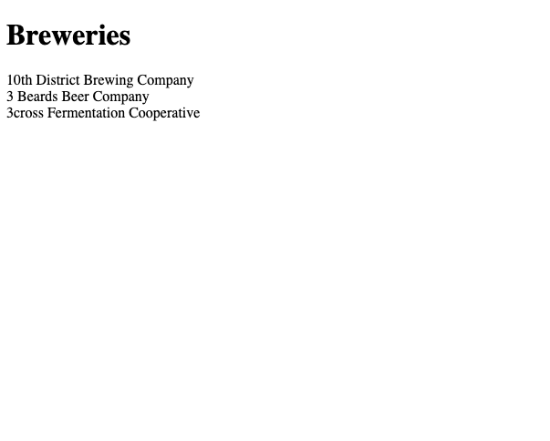

# Using the Javascript Fetch API

Here is a short tutorial on how to use the Javascript Fetch API.
In this tutorial we will create a basic HTML webpage and a Javascript file that will use the Fetch API's fetch() method to retrieve and display
data from the [Open Brewery DB](https://www.openbrewerydb.org/) API.

## What is the Fetch API and why use it?
The Fetch API is a native Javascript API and a modern alternative to Javascript's older solution to asynchronous data, `XMLHttpRequest`. 
It takes advantage of Javascript's [Promise](https://developer.mozilla.org/en-US/docs/Web/JavaScript/Reference/Global_Objects/Promise) object 
and allows for writing clean, readable code and easier error handling.

>The Fetch API provides a JavaScript interface for accessing and manipulating parts of the HTTP pipeline, such as requests and responses.
>It also provides a global fetch() method that provides an easy, logical way to fetch resources asynchronously across the network.
> 
>-- <cite>[Mozilla Developer Network web docs](https://developer.mozilla.org/en-US/docs/Web/API/Fetch_API/Using_Fetch)</cite> 

## Prerequisites
To get the most from this tutorial, you should have some basic knowledge of the following
- HTML
- Javascript
- Javascript Promises
- JSON

## Step 1: Create and prepare the HTML file
Create an HTML file called `test.html` and add the following HTML boilerplate code.
This is the basic HTML code for a webpage with a `<title>` and `<h1>` header of "Massachusetts Breweries".
```html
<!DOCTYPE html>
<html lang="en">
  <head>
    <meta charset="UTF-8">
    <meta name="viewport" content="width=device-width, initial-scale=1.0">
    <meta http-equiv="X-UA-Compatible" content="ie=edge">
    <title>Massachusetts Breweries</title>
  </head>
  <body>
    <h1>Massachusetts Breweries</h1>
  </body>
</html>
```

Within the `<body>` tag, add a `<p>` tag with the id attribute of `demo`.
This is where the data we will fetch from the Open Brewery DB API will be displayed. 
We will also add a `<script>` tag with the `src` attribute equal to `test.js`.
This is the name of the JS file where we will add our `fetch()` function in the next step.
```html
<p id="demo"></p>
<script src="test.js"></script>
```

The HTML file should now look like this.
```html
<!DOCTYPE html>
<html lang="en">
  <head>
    <meta charset="UTF-8">
    <meta name="viewport" content="width=device-width, initial-scale=1.0">
    <meta http-equiv="X-UA-Compatible" content="ie=edge">
    <title>Massachusetts Breweries</title>
  </head>
  <body>
    <h1>Massachusetts Breweries</h1>
    <p id="demo"></p>
	<script src="test.js"></script>
  </body>
</html>
```

## Step 2: Fetching and displaying the data
Create a Javascript file called `test.js` in the same directory as the `test.html` file.
Here we will get the HTML element `demo` and assign it to a variable.
```js
let demo = document.getElementById("demo");
```

We can now use the fetch() function to retrieve data from Open Brewery DB.
The fetch() function takes the Open Brewery DB URL as a parameter and returns a promise that resolves with an HTML Response object.
Also note we are using the query parameters `by_state` and `per_page` to filter the results by the state of Massachusetts and limiting the number of results returned to 10.
```js
fetch("https://api.openbrewerydb.org/breweries?by_state=massachusetts&per_page=10")
```

Now we can use the then() function which will run on the completion of the fetch() function.
It will return another Promise object and has a json() callback function.
This will parse the results into JSON format.
```js
fetch("https://api.openbrewerydb.org/breweries?by_state=massachusetts&per_page=10")
  .then(response => response.json())
```

We can now chain another then() function to use the JSON data.
Here we are using the map() function to loop through the JSON data and add the name of each brewery to the `<p>` tag with the id attribute of `demo` we created earlier.
```js
fetch("https://api.openbrewerydb.org/breweries?by_state=massachusetts&per_page=10")
  .then(response => response.json())
  .then(data => {
    data.map(brewery => {
      demo.innerHTML += `${brewery.name}` + '<br>'
    })
  })
```

Finally, we can catch and print any errors that we have encountered to the console.
```js
fetch("https://api.openbrewerydb.org/breweries?by_state=massachusetts&per_page=10")
  .then(response => response.json())
  .then(data => {
    data.map(brewery => {
      demo.innerHTML += `${brewery.name}` + '<br>'
    })
  })
  .catch(error => {
    console.error(error);
  });
```

## Step 3: View the results
And that is it!
Open the HTML file in a web browser and you should see the results.
We are asynchronously loading and displaying the first 10 Massachusetts breweries returned from the Open Brewery DB with the Fetch API.

>

## Additional resources
Of course there is more to the Fetch API than we have covered here. 
Here are some good resources for further learning.

- For a more in-depth explanation of the Fetch API please refer to the [Mozilla Developer Network documentation](https://developer.mozilla.org/en-US/docs/Web/API/Fetch_API).
- Google Developers fetch() introduction [https://developers.google.com/web/updates/2015/03/introduction-to-fetch](https://developers.google.com/web/updates/2015/03/introduction-to-fetch)


