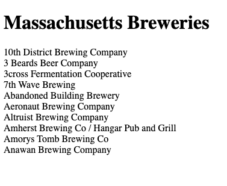

# Using the Javascript Fetch API

Here is a short tutorial on how to use the [Javascript Fetch API](https://developer.mozilla.org/en-US/docs/Web/API/Fetch_API/Using_Fetch).
In this tutorial we will create a basic HTML webpage and Javascript (JS) file that will use the Fetch API's fetch() method to retrieve and display
data from the [Open Brewery DB](https://www.openbrewerydb.org/) API.

## What is the Fetch API?
From the Mozilla Developer Network web docs
>The Fetch API provides a JavaScript interface for accessing and manipulating parts of the HTTP pipeline, such as requests and responses.
>It also provides a global fetch() method that provides an easy, logical way to fetch resources asynchronously across the network.

## Why use it?

## Prerequisites
Basic knowledge of HTML, JS, and the JS Promises.

Here are some links to the Mozilla Developer Network web docs in case you need a refresher

[https://developer.mozilla.org/en-US/docs/Web/JavaScript/Guide/Using_promises](https://developer.mozilla.org/en-US/docs/Web/JavaScript/Guide/Using_promises)


## Step 1: HTML Boilerplate
Create an HTML file called `test.html` and add the following HTML boilerplate code.
This is the basic HTML code for a webpage with an added header of "Massachusetts Breweries".
```html
<!DOCTYPE html>
<html lang="en">
  <head>
    <meta charset="UTF-8">
    <meta name="viewport" content="width=device-width, initial-scale=1.0">
    <meta http-equiv="X-UA-Compatible" content="ie=edge">
    <title>Massachusetts Breweries</title>
  </head>
  <body>
    <h1>Massachusetts Breweries</h1>
  </body>
</html>
```

## Step 2: Prepare the HTML file
Within the body tag `<body>` under "Massachusetts Breweries" header, add a paragraph tag `<p>` with the id attribute of `demo`.
Within this paragraph tag is where the data we will fetch from the Open Brewery DB API will be displayed. We will also add a `<script>` tag with the `src` attribute equal set to `test.js`.
This is the name of the JS file where we will add our `fetch()` function in the next step.
```html
<p id="demo"></p>
<script src="test.js"></script>
```


## Step 3: Using fetch() and displaying data to our webpage
Create a Javascript file called `test.js` in the same directory as the `test.html` file.
Here we will get the HTML element `demo` and assign it to a variable.
This is where we will display our list of breweries.
```js
let demo = document.getElementById("demo");
```

We can now use the fetch() function to retrieve data from Open Brewery DB.
The fetch() function takes the Open Brewery DB URL and returns a promise that resolves with an HTML Response object.
You can also see we are filtering the results by the state of Massachusetts and limiting the number of results returned to 10.
```js
fetch("https://api.openbrewerydb.org/breweries?by_state=massachusetts&per_page=10")
```

Now we can use the then() function which will run on the completion of the fetch() function.
It will return another Promise object with a json() callback function that will take the response from the fetch() function 
and parse the results in JSON format.
```js
fetch("https://api.openbrewerydb.org/breweries?by_state=massachusetts&per_page=10")
  .then(response => response.json())
```

We can now chain another then() function to use the JSON data.
Here we are using the map() function to loop through the JSON data and add the name of each brewery to the 'demo' HTML tag we created earlier.
```js
fetch("https://api.openbrewerydb.org/breweries?by_state=massachusetts&per_page=10")
  .then(response => response.json())
  .then(data => {
    data.map(brewery => {
      demo.innerHTML += `${brewery.name}` + '<br>'
    })
  })
```

Finally, we can print any errors that we have encountered.
```js
fetch("https://api.openbrewerydb.org/breweries?by_state=massachusetts&per_page=10")
  .then(response => response.json())
  .then(data => {
    data.map(brewery => {
      demo.innerHTML += `${brewery.name}` + '<br>'
    })
  })
  .catch(error => {
    console.error(error);
  });
```

## Results
And that is it!  Your webpage should look something like this.



For a more in-depth explanation of the Fetch API please refer to the official documentation [https://developer.mozilla.org/en-US/docs/Web/API/Fetch_API/Using_Fetch](https://developer.mozilla.org/en-US/docs/Web/API/Fetch_API/Using_Fetch).


Other things
https://www.digitalocean.com/community/tutorials/how-to-use-the-javascript-fetch-api-to-get-data
file:///Users/dan/Sites/danstafford.github.io/test.html


## From the official docs.
> The Response object, in turn, does not directly contain the actual JSON response body but is instead a representation 
> of the entire HTTP response. So, to extract the JSON body content from the Response object, we use the json() method, 
> which returns a second promise that resolves with the result of parsing the response body text as JSON.


